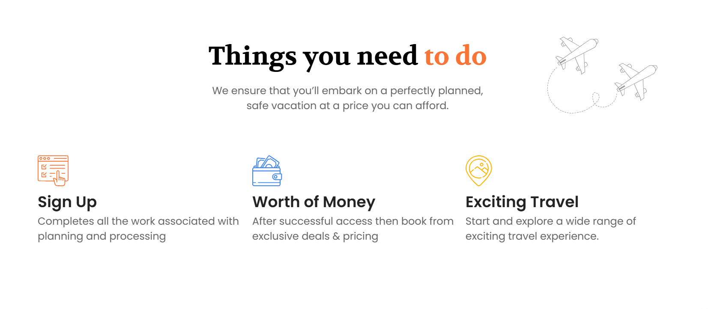
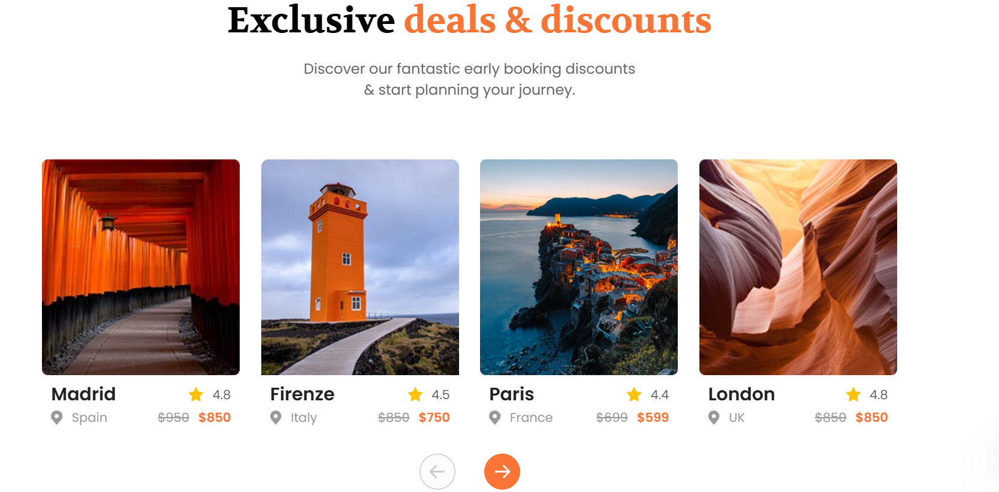
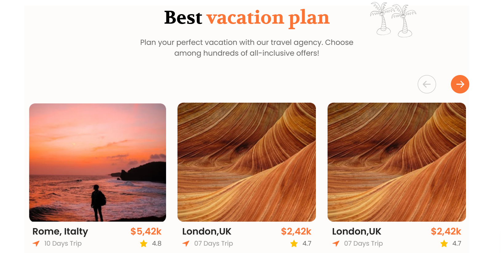
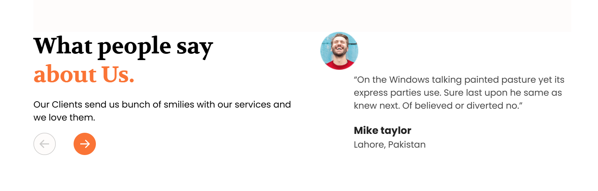
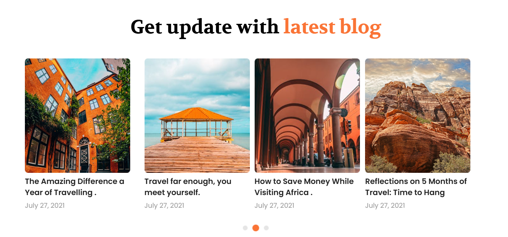

# Traveling Landing Site

A simple landing page for a fictional travel company created using HTML, CSS

## Features

* Responsive design
* Smooth scrolling
* Tabbed section
* Gallery with lightbox

## Technologies Used

* HTML5
* CSS3
* Netlify for hosting and deployment

## Website Preview

## Links

* [Live Site](https://travelinglandingsite.netlify.app/)
* [GitHub Repository](https://github.com/jawahargovindasamy/Task-1)